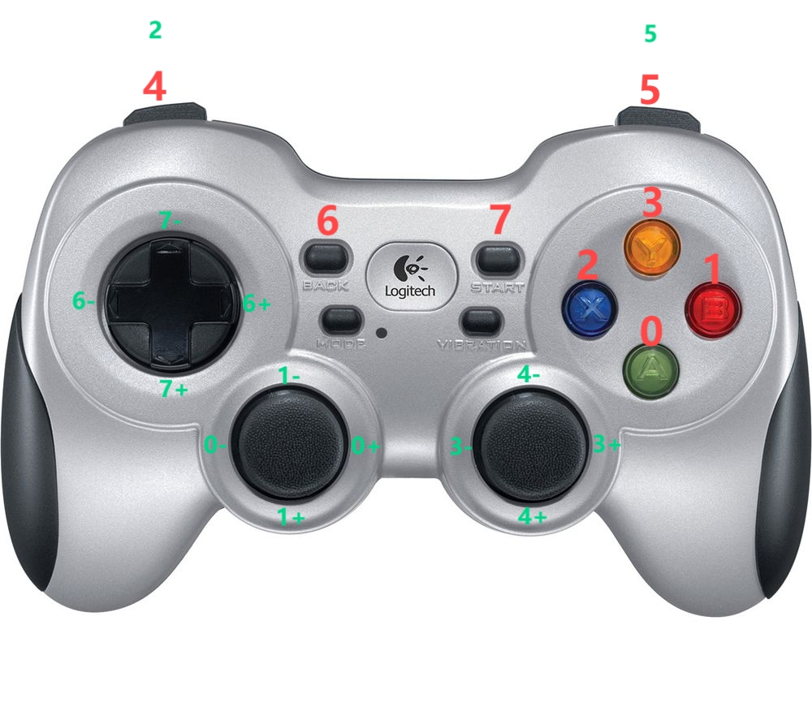

[English](README.md) | [中文](README.zh_CN.md) | 日本語
## 概要
[智元灵犀X1](https://www.zhiyuan-robot.com/qzproduct/169.html) は、智元が開発しオープンソース化したモジュラー型の高自由度ヒューマノイドロボットです。X1のソフトウェアシステムは、智元のオープンソースコンポーネント `AimRT` をミドルウェアとして使用し、強化学習を用いて運動制御を実現しています。

このプロジェクトは、智元灵犀X1で使用される強化学習トレーニングコードです。智元灵犀X1に付属する[推論ソフトウェア](https://aimrt.org/)と組み合わせて、実機およびシミュレーションでの歩行デバッグを行うことができます。また、他のロボットモデルにインポートしてトレーニングを行うことも可能です。


## コードの実行

### 依存関係のインストール
1. 新しいPython 3.8仮想環境を作成します:
   - `conda create -n myenv python=3.8`.
2. pytorch 1.13 と cuda-11.7 をインストールします:
   - `conda install pytorch==1.13.1 torchvision==0.14.1 torchaudio==0.13.1 pytorch-cuda=11.7 -c pytorch -c nvidia`
3. numpy-1.23 をインストールします:
   - `conda install numpy=1.23`.
4. Isaac Gym をインストールします:
   - Isaac Gym Preview 4 を https://developer.nvidia.com/isaac-gym からダウンロードしてインストールします。
   - `cd isaacgym/python && pip install -e .`
   - `cd examples && python 1080_balls_of_solitude.py` でサンプルを実行します。
   - トラブルシューティングについては `isaacgym/docs/index.html` を参照してください。
6. トレーニングコードの依存関係をインストールします:
   - このリポジトリをクローンします。
   - `pip install -e .`

### 使用方法
#### トレーニング:
```python scripts/train.py --task=x1_dh_stand --run_name=<run_name> --headless```
- トレーニングされたモデルは `/log/<experiment_name>/exported_data/<date_time><run_name>/model_<iteration>.pt` に保存されます。 `<experiment_name>` は設定ファイルで定義されています。


#### プレイ:
```python /scripts/play.py --task=x1_dh_stand --load_run=<date_time><run_name>```


#### JITモデルの生成:
``` python scripts/export_policy_dh.py --task=x1_dh_stand --load_run=<date_time><run_name>  ```
- JITモデルは ``` log/exported_policies/<date_time>``` に保存されます。

#### ONNXモデルの生成:
``` python scripts/export_onnx_dh.py --task=x1_dh_stand --load_run=<date_time>  ```
- ONNXモデルは ```log/exported_policies/<date_time>``` に保存されます。

#### パラメータの説明：
- task: タスク名
- resume: チェックポイントからトレーニングを再開
- experiment_name: 実行またはロードする実験の名前。
- run_name: 実行の名前。
- load_run: resume=True の場合にロードする実行の名前。-1 の場合は最後の実行をロードします。
- checkpoint: 保存されたモデルのチェックポイント番号。-1 の場合は最後のチェックポイントをロードします。
- num_envs: 作成する環境の数。
- seed: ランダムシード。
- max_iterations: 最大トレーニング反復回数。

### 新しい環境の追加
1. `envs/`ディレクトリに新しいフォルダを作成し、そのフォルダに `<your_env>_config.py` と `<your_env>_env.py` という設定ファイルと環境ファイルを作成します。これらのファイルはそれぞれ `LeggedRobotCfg` と `LeggedRobot` を継承する必要があります。

2. 新しいロボットのURDF、メッシュ、MJCFファイルを `resources/`フォルダに配置します。
- `<your_env>_config.py` で新しいロボットのURDFパス、PDゲイン、ボディ名、デフォルトジョイント角度、experiment_nameなどを設定します。

3. `humanoid/envs/__init__.py` で新しいロボットを登録します。

### sim2sim
mujocoを使用してsim2sim検証を行います：
  ```
  python scripts/sim2sim.py --task=x1_dh_stand --load_model /path/to/exported_policies/
  ```


### ジョイスティックの使用
Logitech f710ジョイスティックを使用します。play.pyおよびsim2sim.pyを起動する際に、ボタン4を押しながらジョイスティックを回転させることで、ロボットを前後左右および回転させることができます。

|         ボタン          |         コマンド         |
| -------------------- |:--------------------:|
|         4 + 1-       |         前進          |
|         4 + 1+       |         後退          |
|         4 + 0-       |        左平移         |
|         4 + 0+       |        右平移         |
|         4 + 3-       |       反時計回りに回転       |
|         4 + 3+       |       時計回りに回転       |


## ディレクトリ構造
```
.
|— humanoid           # メインコードディレクトリ
|  |—algo             # アルゴリズムディレクトリ
|  |—envs             # 環境ディレクトリ
|  |—scripts          # スクリプトディレクトリ
|  |—utilis           # ツール、機能ディレクトリ
|— logs               # モデルディレクトリ
|— resources          # リソースライブラリ
|  |— robots          # ロボットのurdf, mjcf, メッシュ
|— README.md          # 説明文書
```


> 参考プロジェクト:
>
> * [GitHub - leggedrobotics/legged_gym: Isaac Gym Environments for Legged Robots](https://github.com/leggedrobotics/legged_gym)
> * [GitHub - leggedrobotics/rsl_rl: Fast and simple implementation of RL algorithms, designed to run fully on GPU.](https://github.com/leggedrobotics/rsl_rl)
> * [GitHub - roboterax/humanoid-gym: Humanoid-Gym: Reinforcement Learning for Humanoid Robot with Zero-Shot Sim2Real Transfer https://arxiv.org/abs/2404.05695](https://github.com/roboterax/humanoid-gym)


